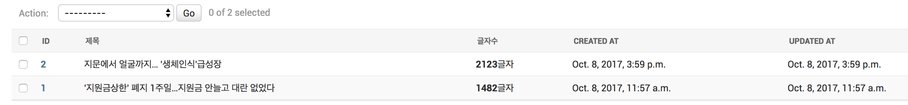

**Admin** 은 staff또는 superuser 계정에 한해서만 접근이 가능한 일종의 관리자 권한을 가지는 페이지이다. 또한, 모델 클래스만 등록하면 조회/추가/수정/삭제 등의 웹 인터페이스가 제공된다. 

**모델 클래스 등록하기**

Admin에는 ModelAdmin이 있다. 그러므로 모델만 등록해도 기본 ModelAdmin이 동작한다. 따라서 기본적인 조회/추가/수정/삭제가 가능한 것이다.
모델 클래스를 등록하는 방법은 3가지가 있다.

등록법1

```python
admin.site.register(Post) # 기본 모델 Admin으로 등록
```

등록법2

```	python
class PostAdmin(admin.ModelAdmin):
    list_display = ['id', 'title', 'created_at', 'updated_at']

admin.site.register(Post, PostAdmin) # 같은 모델 중복 등록 불가
```
등록법3(데코리에터 형태로 지원)

```python
@admin.register(Post)
class PostAdmin(admin.ModelAdmin):
    list_display = ['id', 'title', 'created_at', 'updated_at']
```

<br><br>

**ModelAdmin Options**

- list_display : Admin 목록에 보여진 필드 목록
- list_display_link : 목록 내에서 링크로 지정할 필드 목록(이를 지정하지 않으면, 첫번째 필드에만 링크가 적용)
- list_editable : 목록 상에서 수정할 필드 목록
- list_per_page : 페이지 별로 보여질 최대 갯수(default : 100)
- list_filter : 필터 옵션을 제공할 필드 목록
- actions : 목록에서 수행할 action 목록

**ModelAdmin Options** (django form을 어느정도 이해해야 사용가능한 options)

- fields : add/change 폼에 노출할 필드 목록
- fieldsets : add/change 폼에 노출할 필드 목록(fieldset)
- formfield_overrides : 특정 Form Field에 대한 속성 재정의
- form : default로 모델 클래스에 대한 Form Class 지정 


<br><br>

**list_display**

모델 인스턴스 필드명/속성명/함수명 뿐만 아니라, ModelAdmin 내 멤버함수도 지정 가능.<br>
외래키를 지정한다면 관련 object의 \_\_str\_\_()값이 노출<br>
ManyToManyField 미지원<br><br>

list\_display를 사용하고 mark\_safe()를 이용하여 autoescape-off한 코드<br>
> 장고에서 기본적으로 지원되는 autoescape를 끄기 위해선 mark\_safe()외에도 format\_html, format\_html\_join() 등의 함수가 있다.

```python
@admin.register(Post)
class PostAdmin(admin.ModelAdmin):
    list_display = ['id', 'title', 'content_size', 'created_at', 'updated_at']

    def content_size(self, post):
        return mark_safe('<strong>{}</strong>글자'.format(len(post.content)))

    content_size.short_description = '글자수'
```

결과 - admin 페이지의 post 모델


<br><br>

**actions**

대게 선택된 Model Instance 들에 대해 Bulk Update(Instance들을 일괄적으로 update) 용도<br>
구현
1. ModelAdmin 클래스 내 멤버함수로 action 함수를 구현(멤버함수.short_description 을 통해 action 설명추가)
2. ModelAdmin actions 내에 등록

<br>

blog application의 post모델에 글의 상태를 나타내는 status 필드를 추가하고 싶다고 해보자.

1. models.py에 등록을 한다.

models.py

```python
    STATUS_CHOICES = (
        ('d', 'Draft'),
        ('p', 'Published'),
        ('w', 'Withdrawn'),
    )
    
status = models.CharField(max_length=1, choices=STATUS_CHOICES)
```

2. migration file 을 생성하고 migrate 한다.

> 잠깐! makemigrations를 하면 기존에 존재하던 row들 안의 status필드값을 어떻게 할 것인지 물을 것이다. 'd'로 지정해주자.

```python
$ ./manage.py makemigrations blog
$ ./manage.py migrate blog
``` 

3. admin에 Post model이 등록되어 있으므로 마음껏 admin.py에서 사용해준다.

```python
    def make_published(self, request, queryset):
        updated_count = queryset.update(status='p')
        # django message framework 사용
        self.message_user(request, '{}건의 포스팅을 published 상태로 변경하였습니다.'.format(updated_count))
        
	make_published.short_description = '지정 포스팅을 published 상태로 변경합니다'
```

